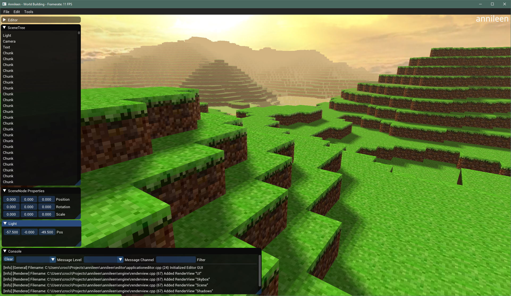

[](https://travis-ci.com/CrociDB/annileen)

This is a toy 3D game engine created for study purposes. It's written in C++ and uses **bgfx** for rendering. Currently runs on **Windows** and **Linux** and supports **OpenGL 2.1**, **DirectX 9**, **DirectX 11**, **DirectX 12** and **Vulkan**.

It's still on an early stage of development, but already supports:
 - Minecraft-style voxels



## Dependencies

 - premake5
 - python 3.8 / pip3

## Build

First of all, update all submodules and download Python dependencies:

```
git submodule init && git submodule update
python -m pip install -r tools/requirements.txt
```

### Windows

Generate the Visual Studio solution:

```
premake5 vs2019
```

Open the solution located at `.\build\vs2019\annileen-engine.sln` and build.

Now, generate the assets:

```
python tools/asset_tools.py
```

Now you can run the projects on Visual Studio.

### Linux

Install dependecies:

```
sudo apt install libglu1-mesa-dev freeglut3-dev mesa-common-dev xorg-dev libglew-dev libx11-dev libxrandr-dev libxcursor-dev libxinerama-dev
```

Build:

```
premake5 gmake
make
python tools/asset_tools.py
```

### Mac OS

Still in development.


## Asset Tools

In order to build all the assets available at the `./assets` folder, run:

```
python tools/asset_tools.py
```

It will generate a `build_assets` folder in the project root and will also create a `assets.toml` with a description of all the assets and their types.

All the other the specific tools will accept an asset name, no need to include the full path of the file, it will find the asset within the `asset` folder and build it to its corresponding built folder, but **note**: it will not update the `assets.toml` descriptor file. 

### Shader Tool

```
python tools/shader.py
```
```
usage: shader.py [-h] [-s [SHADER [SHADER ...]]] [-f] [-a] [-p {auto,android,asm.js,ios,linux,orbis,osx,windows}]
                 [-m {auto,s_3_0,s_4_0,s_4_0_level,s_5_0,metal,pssl,spirv,120}]

Annileen Shader Tools

optional arguments:
  -h, --help            show this help message and exit
  -s [SHADER [SHADER ...]], --shader [SHADER [SHADER ...]]
                        compiles the shader specified
  -f, --force           force rebuild
  -a, --all             compiles all the available shaders
  -p {auto,android,asm.js,ios,linux,orbis,osx,windows}, --platform {auto,android,asm.js,ios,linux,orbis,osx,windows}
                        compiles the mesh specified
  -m {auto,s_3_0,s_4_0,s_4_0_level,s_5_0,metal,pssl,spirv,120}, --model {auto,s_3_0,s_4_0,s_4_0_level,s_5_0,metal,pssl,spirv,120}
                        shader model
```

If no `platform` is specified, it will build for tre host platform. The default build model is OpenGL (GLSL), for other APIs, use:

 - DirectX: `s_5_0`
 - Vulkan: `spirv`
 - Metal: `metal`


### Mesh Tool

```
python tools/mesh.py
```
```
usage: mesh.py [-h] [-m [MESH [MESH ...]]] [-a] [-f] [-v VIEW]

Annileen Mesh Tools

optional arguments:
  -h, --help            show this help message and exit
  -m [MESH [MESH ...]], --mesh [MESH [MESH ...]]
                        compiles the mesh specified
  -a, --all             compiles all the available meshes
  -f, --force           force rebuild
  -v VIEW, --view VIEW  view the specified mesh
```

### Texture Tool

```
python tools/texture.py
```
```
usage: texture.py [-h] [-t [TEXTURE [TEXTURE ...]]] [-a] [-v VIEW]

Annileen Texture Tools

optional arguments:
  -h, --help            show this help message and exit
  -t [TEXTURE [TEXTURE ...]], --texture [TEXTURE [TEXTURE ...]]
                        compiles the texture specified
  -a, --all             compiles all the available textures
  -v VIEW, --view VIEW  view the specified mesh
```

### Cubemap Tool

```
python tools/cubemap.py
```
```
usage: cubemap.py [-h] [-c [CUBEMAP [CUBEMAP ...]]] [-a] [-v VIEW]

Annileen Cubemap Tools

optional arguments:
  -h, --help            show this help message and exit
  -c [CUBEMAP [CUBEMAP ...]], --cubemap [CUBEMAP [CUBEMAP ...]]
                        compiles the cubemap specified
  -a, --all             compiles all the available cubemaps
  -v VIEW, --view VIEW  view the specified cubemap
```


### Font Tool

```
python tools/font.py
```
```
usage: font.py [-h] [-f [FONT [FONT ...]]] [-a]

Annileen Font Tools

optional arguments:
  -h, --help            show this help message and exit
  -f [FONT [FONT ...]], --font [FONT [FONT ...]]
                        compiles the font specified
  -a, --all             compiles all the available fonts
```

# Contributors

  - Bruno Croci - [CrociDB](https://twitter.com/CrociDB)
  - Teofilo Dutra - [teodutra](https://twitter.com/teodutra)

# License

Annileen is licensed under the [MIT License](/LICENSE.md)

# Third Party

Annileen uses the following libraries:

  - [bgfx](https://github.com/bkaradzic/bgfx) - [BSD 2-Clause](https://github.com/bkaradzic/bgfx/blob/master/LICENSE)
  - [toml11](https://github.com/ToruNiina/toml11) - [MIT License](https://github.com/ToruNiina/toml11/blob/master/LICENSE)
  - [glm](https://github.com/g-truc/glm) - [The Happy Bunny License/MIT](https://github.com/g-truc/glm/blob/master/copying.txt)
  - [glfm](https://github.com/glfw/glfw) - [zlib License](https://github.com/glfw/glfw/blob/master/LICENSE.md)
  - [fmt](https://github.com/fmtlib/fmt) - [License](https://github.com/fmtlib/fmt/blob/master/LICENSE.rst)
  - [PerlinNoise](https://github.com/Reputeless/PerlinNoise) - [MIT License](https://github.com/Reputeless/PerlinNoise/blob/master/LICENSE)
  - [assimp](https://github.com/assimp/assimp) - [BSD-Custom License](https://github.com/assimp/assimp/blob/master/LICENSE)
  - [fmt](https://github.com/fmtlib/fmt) - [Custom License](https://github.com/fmtlib/fmt/blob/master/LICENSE.rst)
  